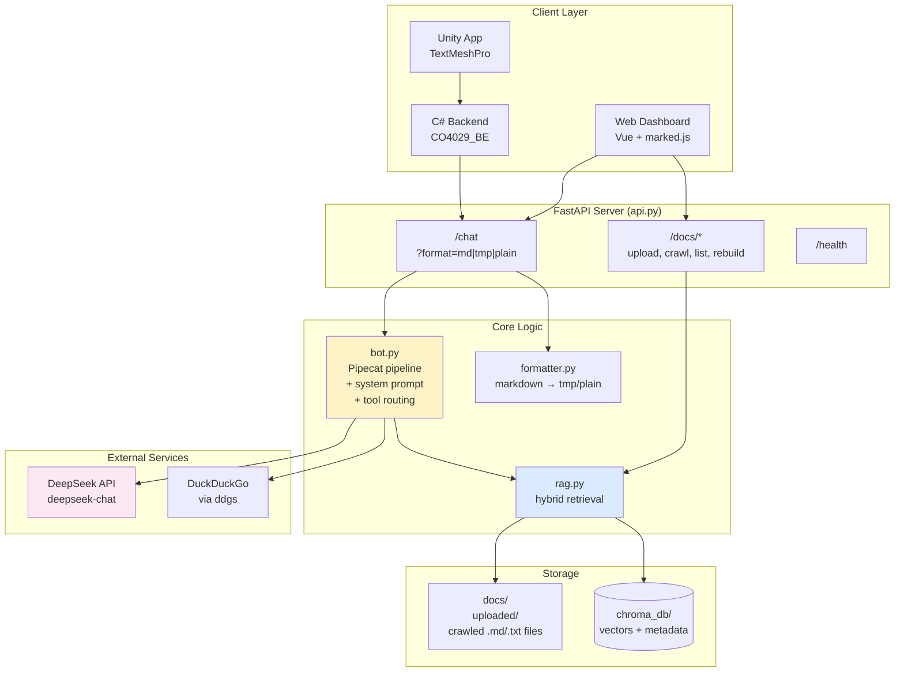
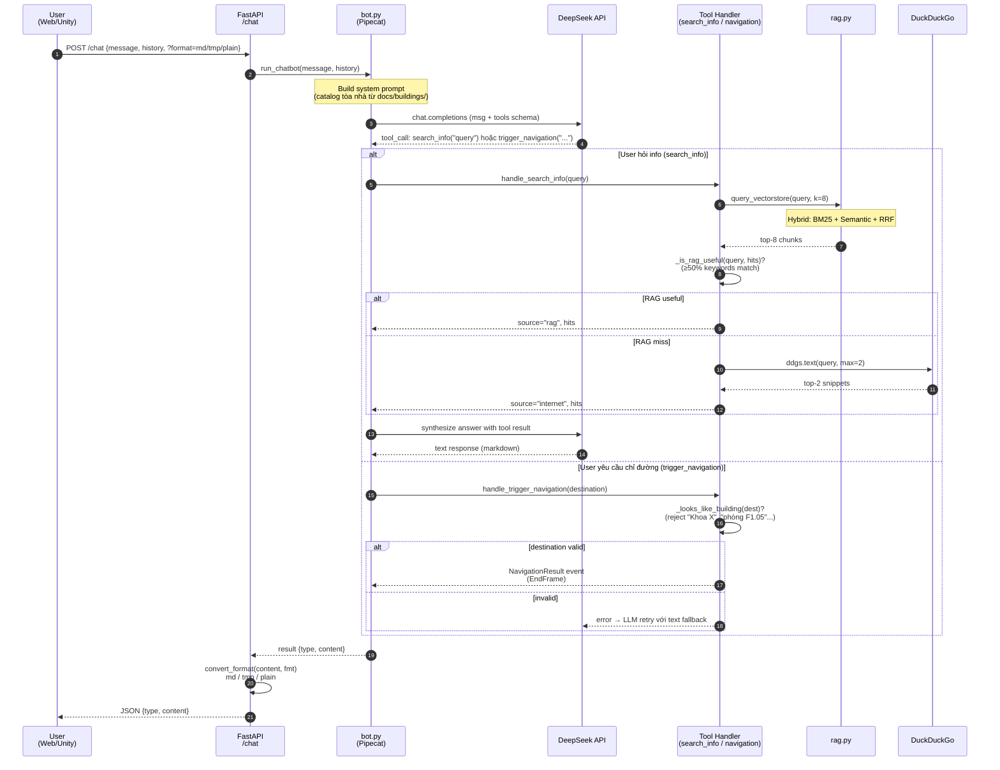
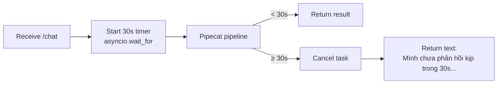
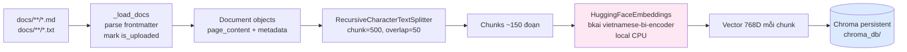
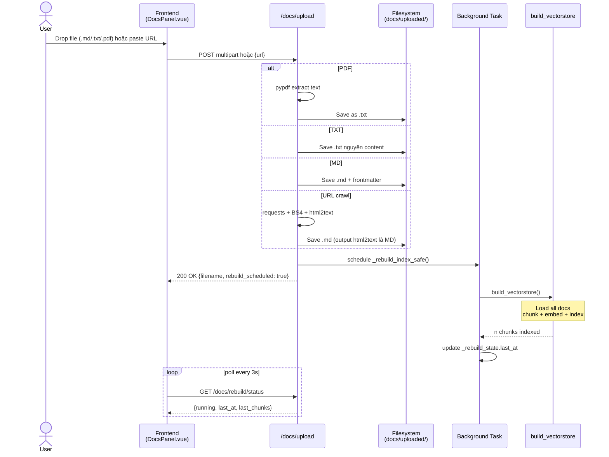
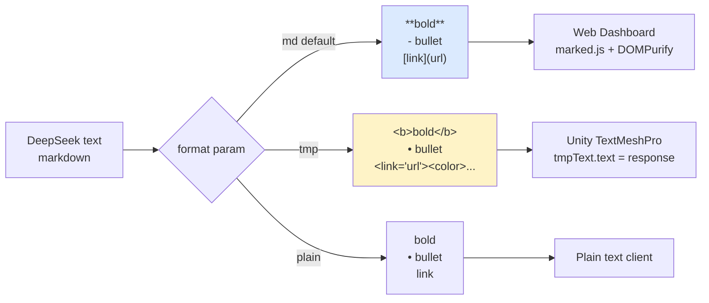

# HCMUT Chatbot — Kiến trúc & Luồng hoạt động

Tài liệu này giải thích chi tiết cách chatbot HCMUT hoạt động: kiến trúc tổng thể, các thành phần cốt lõi, luồng xử lý 1 câu hỏi, và các quyết định thiết kế.

> **Mục tiêu chatbot**: trợ lý ảo HCMUT có thể (1) trả lời câu hỏi về trường, (2) chỉ đường tới tòa nhà, (3) tìm trên internet khi không có thông tin nội bộ. Output có thể được hiển thị trên web (markdown), Unity (TMP rich text), hoặc plain text.

---

## 1. Tổng quan tính năng

| Tính năng | Mô tả |
|---|---|
| **Chat hỏi đáp** | Trả lời câu hỏi về HCMUT (chương trình đào tạo, tòa nhà, học phí…) dựa trên knowledge base |
| **Trigger Navigation** | Khi user yêu cầu dẫn đường, trả về `{event, destination_building}` để frontend hoặc Unity điều hướng |
| **Internet Fallback** | Tự động search DuckDuckGo/Tavily khi knowledge base không có thông tin |
| **Knowledge Base Management** | Upload `.md` / `.txt` / `.pdf` qua web UI hoặc crawl từ URL |
| **Multi-format Output** | Markdown (web), TMP rich text (Unity), plain text |
| **Hard Timeout** | Tự cancel + fallback text nếu request quá 30s |

---

## 2. Tech Stack

| Layer | Công nghệ | Vai trò |
|---|---|---|
| **LLM** | DeepSeek (`deepseek-chat`) qua OpenAI-compatible API | Reasoning + tool calling + text generation |
| **Pipeline orchestration** | Pipecat | Quản lý dialog flow, tool calling, streaming |
| **Vector DB** | Chroma (persistent SQLite + HNSW index) | Lưu vector embeddings, similarity search |
| **Embedding model** | `bkai-foundation-models/vietnamese-bi-encoder` (768D) | Vector hóa tiếng Việt, chạy local CPU |
| **Sparse retriever** | BM25Okapi (`rank_bm25`) | Keyword matching, bù điểm yếu của semantic |
| **Internet search** | DuckDuckGo qua `ddgs` (default) hoặc Tavily | Fallback khi RAG không có data |
| **Backend** | FastAPI + Uvicorn | HTTP server, REST API |
| **Frontend** | Vue 3 + Vite + TailwindCSS + marked.js | Dashboard chat + knowledge base management |
| **Crawler** | Playwright headless Chromium ([scripts/crawl.py](scripts/crawl.py)) | Crawl SPA site khi cần (chạy LOCAL, không deploy) |
| **PDF extraction** | `pypdf` | Convert PDF → text khi upload |
| **Deploy** | Render | Single web service, free tier |

---

## 3. Kiến trúc tổng thể



---

## 4. Luồng xử lý 1 câu hỏi (Request Flow)

### 4.1 Sequence diagram



### 4.2 Diễn giải từng bước

1. **Client gửi POST /chat** với body `{message, history}` và query param `?format=md|tmp|plain`
2. **FastAPI** gọi `run_chatbot()` trong `bot.py`
3. **bot.py** build system prompt động:
   - Đọc `docs/buildings/*.md` lấy catalog (tên tòa + khoa) đưa vào prompt
   - System prompt mô tả 3 luồng + danh sách tools available
4. **Pipecat pipeline** chạy: user_aggregator → LLM → assistant_aggregator → output_collector
5. **DeepSeek** nhận message + tool schemas → quyết định gọi tool nào:
   - `trigger_navigation(destination_building)` — nếu user yêu cầu dẫn đường
   - `search_info(query)` — cho mọi câu hỏi thông tin
6. **Tool handler** thực thi tool, trả kết quả về LLM context
7. **DeepSeek round 2** đọc tool result, tổng hợp câu trả lời text
8. **OutputCollector** nhận text response, queue `EndFrame` để kết thúc pipeline
9. **api.py** áp dụng `format` conversion lên `content`:
   - `md`: giữ nguyên markdown
   - `tmp`: convert `**bold**` → `<b>bold</b>`, etc. cho Unity
   - `plain`: strip mọi markdown
10. **Response** JSON `{type: "text"|"navigation", content: ...}`

### 4.3 Timeout & error handling



---

## 5. 3 Luồng quyết định (Decision Flow)

LLM quyết định gọi tool nào dựa trên user message:

```mermaid
flowchart TD
    Q[User Message] --> CLASSIFY{User message<br/>có pattern yêu cầu<br/>dẫn đường?<br/>("chỉ đường", "đi đến",<br/>"dẫn tôi"...)}

    CLASSIFY -->|Có| NAV_RESOLVE{Destination<br/>là TÊN TÒA<br/>hay khoa/phòng?}
    NAV_RESOLVE -->|Tòa| NAV[trigger_navigation<br/>destination_building=Tòa X]
    NAV_RESOLVE -->|Khoa/Phòng| NAV_LOOKUP{Có trong<br/>DANH BẠ<br/>system prompt?}
    NAV_LOOKUP -->|Có| NAV
    NAV_LOOKUP -->|Không| NAV_SEARCH[search_info<br/>tìm khoa→tòa]
    NAV_SEARCH --> NAV_OK{Tìm được<br/>tòa cụ thể?}
    NAV_OK -->|Có| NAV
    NAV_OK -->|Không| TEXT_NOT_FOUND["Text:<br/>Mình không biết khoa này<br/>ở tòa nào"]

    CLASSIFY -->|Không| INFO[search_info<br/>query=truy vấn]
    INFO --> RAG_CHECK{RAG hits<br/>useful?<br/>≥50% keyword match}
    RAG_CHECK -->|Có| TEXT_RAG["Text trả lời<br/>từ RAG context"]
    RAG_CHECK -->|Không| INTERNET[DDG search<br/>top-2 snippet]
    INTERNET --> NET_OK{Có hits?}
    NET_OK -->|Có| TEXT_NET["Text trả lời<br/>từ internet, cite URL"]
    NET_OK -->|Không| TEXT_NO_INFO["Text:<br/>Chưa tìm được thông tin"]

    NAV --> GUARD{Destination<br/>looks like<br/>building?}
    GUARD -->|Có| NAV_OUTPUT["Output {type:navigation,<br/>destination_building}"]
    GUARD -->|Không<br/>(có 'khoa', 'phòng', dot)| NAV_REJECT[Reject + tell LLM<br/>fallback text]
    NAV_REJECT --> TEXT_NOT_FOUND

    style NAV fill:#fef3c7
    style INFO fill:#dbeafe
    style TEXT_NO_INFO fill:#fee2e2
    style TEXT_NOT_FOUND fill:#fee2e2
```

### Tại sao chia 3 luồng?

- **Luồng 1 (Navigation)**: kích hoạt event điều hướng — output structured data, không phải text
- **Luồng 2 (Info, RAG → Internet)**: trả lời text. **Code orchestrate fallback** (không phải LLM tự quyết) → đảm bảo nhất quán, LLM không "lười" stop ở RAG khi RAG không có data
- **Luồng 3 (Not found)**: chỉ kích hoạt khi cả RAG lẫn Internet đều fail → tránh bịa thông tin

---

## 6. RAG Pipeline (Indexing)

### 6.1 Build vector store (offline, chạy 1 lần)



**Chi tiết các bước**:

1. **Load** ([rag.py:_load_docs](rag.py)):
   - Scan đệ quy `docs/`, lấy mọi `.md` và `.txt`
   - Parse YAML frontmatter (chỉ `.md`)
   - Mark `is_uploaded=true` cho file trong `docs/uploaded/` (để boost sau)

2. **Chunk** ([rag.py:build_vectorstore](rag.py)):
   - `RecursiveCharacterTextSplitter(chunk_size=500, chunk_overlap=50, separators=["\n\n", "\n", ". ", " ", ""])`
   - Cố split tại boundary tự nhiên (paragraph > newline > câu > từ)
   - Overlap 50 chars để câu trả lời vắt qua biên không bị cắt

3. **Embed**:
   - Model: `bkai-foundation-models/vietnamese-bi-encoder` — bi-encoder do BK AI Lab (HCMUT) train, specialized tiếng Việt
   - Local CPU, không cần API key
   - Mỗi chunk → 768-dim float vector

4. **Store**:
   - Chroma persistent → SQLite + HNSW (Hierarchical Navigable Small World) index
   - `chroma_db/chroma.sqlite3` + binary files
   - Survive restart, không cần rebuild

### 6.2 Hybrid Retrieval (query time)

```mermaid
flowchart TB
    Q[Query: 'Khoa Cơ khí ở tòa nào'] --> SEM[Semantic Search<br/>Chroma similarity<br/>top-2k chunks]
    Q --> KEY[BM25 keyword<br/>top-2k chunks]

    SEM --> RRF[Reciprocal Rank Fusion<br/>score = Σ weight/(60+rank)]
    KEY --> RRF

    RRF --> WEIGHTS{Apply<br/>weights}
    WEIGHTS -->|is_uploaded=true| BOOST[× 2.5]
    WEIGHTS -->|>40% là links/URLs| PENALTY[× 0.4]
    WEIGHTS -->|else| NORMAL[× 1.0]

    BOOST --> MERGE[Merge + dedup<br/>by content prefix]
    PENALTY --> MERGE
    NORMAL --> MERGE

    MERGE --> RERANK[_rerank_for_location<br/>nếu query hỏi 'ở tòa nào'<br/>→ boost chunks 'Tòa X là của Y']
    RERANK --> TOPK[Top-K final chunks]
    TOPK --> LLM[→ LLM context]
```

**Vì sao cần Hybrid?**

- **Semantic only** (chỉ embeddings): yếu cho keyword match tiếng Việt ngắn (vd "Khoa Cơ khí"). Match nhầm với "Xưởng cơ khí C1" trong noise text.
- **BM25 only**: không hiểu ngữ nghĩa, fail với câu phrasing khác từ doc.
- **Kết hợp 2 + RRF**: ổn định với cả 2 case — đây là approach của LangChain `EnsembleRetriever`, NVIDIA, Anthropic, etc.

**Boost & Penalty (cải tiến riêng cho project này)**:
- **×2.5 cho uploaded**: file user upload có content curated, signal mạnh hơn crawled
- **×0.4 cho link-heavy chunks**: `hcmut.edu.vn` SPA crawl ra nhiều chunks chỉ là `[link](drive.google.com/...)`. Penalty này giảm noise

**Re-rank** ([bot.py:_rerank_for_location](bot.py)):
- Khi query có pattern "ở tòa nào", boost chunks chứa pattern `Tòa X là của Y`
- Fix bug LLM nhầm "Xưởng cơ khí C1" với "Khoa Cơ khí ở C1"

---

## 7. Document Upload Pipeline



---

## 8. Multi-format Output (Web vs Unity)

Cùng 1 markdown response, 3 format output khác nhau:



**Conversion regex** ([formatter.py](formatter.py)):
- `**bold**` → `<b>bold</b>`
- `*italic*` → `<i>italic</i>`
- `# H1` → `<size=140%><b>H1</b></size>`
- `[text](url)` → `<link="url"><color=#2563eb><u>text</u></color></link>` (clickable trong Unity)
- `- bullet` → `• bullet`
- `> quote` → `<color=#666666>│ quote</color>`

---

## 9. Tổng kết Components & Files

| File | Vai trò | Lines |
|---|---|---|
| [api.py](api.py) | FastAPI server, `/chat` endpoint, mount docs router, serve frontend | ~160 |
| [bot.py](bot.py) | Pipecat pipeline, system prompt, 2 tool handlers, run_chatbot() | ~570 |
| [rag.py](rag.py) | Hybrid retrieval (BM25 + semantic + RRF), build/query vectorstore | ~250 |
| [routers/docs.py](routers/docs.py) | Knowledge base CRUD endpoints (upload, crawl URL, rebuild) | ~280 |
| [formatter.py](formatter.py) | Markdown → TMP rich text / plain converter | ~120 |
| [auth.py](auth.py) | API key header verification | ~20 |
| [scripts/crawl.py](scripts/crawl.py) | Playwright crawler cho hcmut.edu.vn SPA | ~160 |
| [scripts/build_index.py](scripts/build_index.py) | Script CLI gọi `build_vectorstore()` | ~15 |
| [frontend/](frontend/) | Vue 3 dashboard (Chat + Knowledge Base tabs) | — |

---

## 10. Quyết định thiết kế quan trọng

| Vấn đề | Giải pháp | Lý do |
|---|---|---|
| Bot bịa tên tòa khi không biết | Code guardrail `_looks_like_building()` reject "Khoa X", "phòng F1.05" | Prompt-only không đủ — LLM eager. Code-level enforce |
| Bot ưu tiên RAG generic chunks | Boost uploaded ×2.5 + Link penalty ×0.4 | User-uploaded curated > crawled noise (Drive links spam) |
| Embedding multilingual yếu Vietnamese | Switch sang BK AI Lab Vietnamese bi-encoder | Specialized model, MTEB tốt hơn |
| LLM "lười" không fallback internet | Gộp `search_knowledge` + `search_internet` → 1 `search_info`, code orchestrate fallback | Bypass LLM decision, đảm bảo nhất quán |
| hcmut.edu.vn là SPA | Dùng Playwright thay vì requests | Body shell rỗng với requests, JS render mới có content |
| Cold start embed model 10s | `@app.on_event("startup")` warmup + tool timeout 60s | Tránh first request timeout |
| Hard timeout request | `asyncio.wait_for(30s)` + cancel task + fallback text | Tránh user đợi vô tận khi LLM/network hang |
| Multi-client (web/Unity) | `?format=md|tmp|plain` query param, code convert ở api layer | Source of truth = markdown từ LLM, client chỉ định format mong muốn |

---

## 11. Persistence trên Render

Câu hỏi quan trọng cho deploy: **vector database được lưu thế nào?**

### Free tier (mặc định)
- **KHÔNG có persistent disk** — mỗi lần deploy/restart, filesystem reset hoàn toàn
- Hệ quả:
  - `chroma_db/` (vector index): **bị xóa** → auto rebuild từ `docs/` khi server startup (~10-30s)
  - `docs/uploaded/` (user upload): **bị xóa** nếu không commit vào git
  - `docs/*.md` từ crawl/seed: **giữ** nếu commit vào git
- Cơ chế tự rebuild ([api.py:_warmup_rag](api.py)):
  ```python
  @app.on_event("startup")
  async def _warmup_rag():
      if not has_chroma and has_docs:
          build_vectorstore()   # rebuild từ docs/
      query_vectorstore("warmup", 1)  # warm embed model
  ```
- HF embed model (~540MB) cũng tải lại mỗi cold start → lần deploy đầu **~5 phút**, sau cache layer của Render → nhanh hơn

### Starter plan ($7/month)
Bật persistent disk trong [render.yaml](render.yaml) (đã có sẵn block comment):
```yaml
disk:
  name: data
  mountPath: /opt/render/project/src/chroma_db
  sizeGB: 1
```
→ `chroma_db/` persist qua deploys. Có thể thêm disk thứ 2 cho `docs/uploaded/`.

### Khuyến nghị thực tế

| Use case | Persistence strategy |
|---|---|
| Demo / dev | Free tier OK. Auto-rebuild thêm ~30s cold start nhưng acceptable |
| Production small | Free tier + commit `docs/*` vào git để giữ knowledge base qua redeploy |
| Production có user upload | Starter plan với persistent disk |
| Production heavy | Move chroma sang managed (Pinecone, Qdrant Cloud, Weaviate Cloud) — out of scope |

---

## 12. Trade-offs & Hạn chế

| Hạn chế | Workaround / Note |
|---|---|
| Render free tier không persist `docs/uploaded/` + `chroma_db/` | Commit vào git, hoặc upgrade Starter plan |
| HF embed model ~540MB cold start | Pre-warm ở `api.py:startup`. Render lần deploy đầu chậm ~5 phút |
| PDF extract format kém với tables | `pypdf` cơ bản. PDF tables phức tạp → khuyến nghị convert markdown thủ công trước khi upload |
| LLM stochastic — đôi khi inconsistent | Bump retry, hoặc dùng `temperature=0` (hiện 0.3) |
| Tiếng Việt embedding chưa hoàn hảo cho mọi case | Combine BM25 + boost. Vẫn tốt hơn semantic-only |
| DDG rate limit / chậm | Switch sang Tavily nếu cần (set `TAVILY_API_KEY`) |
| Pipeline timeout 30s | Tăng `CHATBOT_TIMEOUT_SECS` nếu chained 2 tool calls quá lâu |

---

## 13. Để thuyết trình — Tóm tắt 5 phút

### Slide 1: Vấn đề
"Sinh viên HCMUT khó tra cứu thông tin trường, không biết khoa nào ở tòa nào, không biết hỏi ai về học phí. Cần chatbot tích hợp được vào app Unity 3D bản đồ trường."

### Slide 2: Kiến trúc
- 3 layer: Client → FastAPI → LLM/RAG/Internet
- Chatbot có 2 tool: `trigger_navigation` + `search_info`
- 1 endpoint `/chat?format=tmp` cho Unity

### Slide 3: RAG
- Knowledge base: upload `.md/.txt/.pdf` qua web UI
- Index: chunk 500 chars → embed BK AI Lab Vietnamese encoder → Chroma
- Retrieve: hybrid BM25 + semantic, RRF merge, boost user files
- Quality: 6/7 query đúng building, 100% query curriculum trả lời đúng số tín chỉ

### Slide 4: 3 Luồng
- Luồng 1: Navigation (có guardrail anti-hallucination)
- Luồng 2: Info — RAG trước, code tự fallback Internet (DuckDuckGo)
- Luồng 3: "Không tìm thấy" — chỉ khi cả 2 fail

### Slide 5: Unity Integration
- DeepSeek output markdown
- Backend convert sang TMP rich text (`<b>`, `<color>`, `<link>`)
- Unity TextMeshPro render trực tiếp

### Slide 6: Demo flow
Live demo 4-5 query:
1. "Khoa Cơ khí ở tòa nào" → Tòa B11 (RAG hit, ~2s)
2. "Chỉ đường tới Khoa Cơ khí" → trigger_navigation Tòa B11 (catalog resolve)
3. "Hiệu trưởng HCMUT là ai" → search_info auto fallback internet (~4s)
4. "Tổng tín chỉ KHMT" → 128 (curriculum file user upload)
5. "Phòng F1.05" → bot từ chối "không biết tòa nào" (anti-hallucination)

---

## 14. Tham khảo nhanh

- **API docs**: `http://localhost:8000/swagger` (FastAPI auto)
- **Setup**: [CLAUDE.md](CLAUDE.md)
- **Deploy**: [DEPLOY.md](DEPLOY.md)
- **Code**: [bot.py](bot.py) (core), [rag.py](rag.py) (retrieval)
