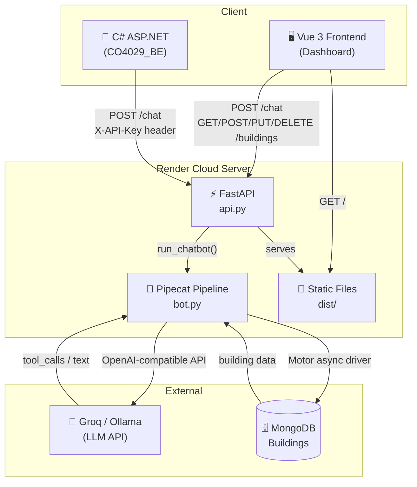
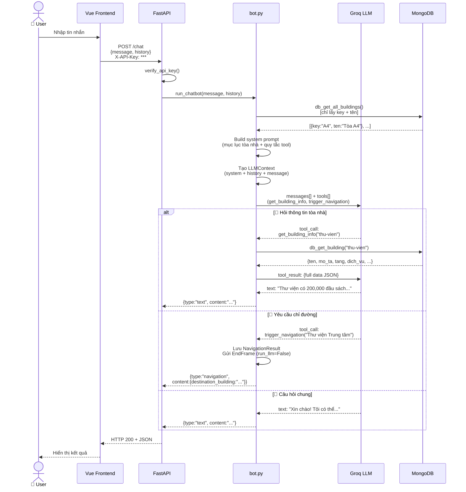
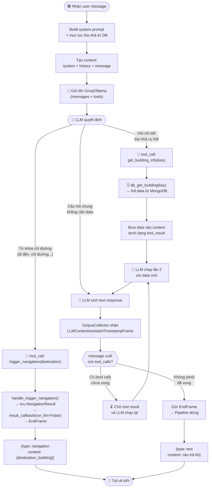
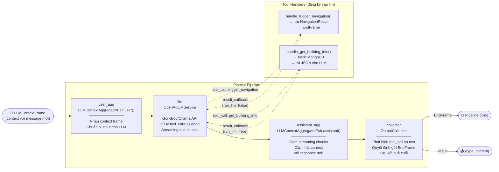

# Kiến trúc & Cơ chế hoạt động — HCMUT Chatbot

## Mục lục
1. [Sơ đồ tổng quan](#1-sơ-đồ-tổng-quan)
2. [Sơ đồ luồng xử lý đầy đủ (Sequence Diagram)](#2-sơ-đồ-luồng-xử-lý-đầy-đủ-sequence-diagram)
3. [Sơ đồ quyết định của LLM (Flowchart)](#3-sơ-đồ-quyết-định-của-llm-flowchart)
4. [Sơ đồ Pipecat Pipeline](#4-sơ-đồ-pipecat-pipeline)
5. [Kiến trúc hệ thống (chi tiết text)](#5-kiến-trúc-hệ-thống-chi-tiết-text)
6. [Luồng xử lý từ A đến Z](#6-luồng-xử-lý-từ-a-đến-z)
7. [LLM Function Calling là gì?](#7-llm-function-calling-là-gì)
8. [Hai tool cụ thể](#8-hai-tool-cụ-thể)
9. [OutputCollector — logic kết thúc pipeline](#9-outputcollector--logic-kết-thúc-pipeline)
10. [Token Optimization](#10-token-optimization)
11. [Tóm tắt nhanh cho phản biện](#11-tóm-tắt-nhanh-cho-phản-biện)

---

## 1. Sơ đồ tổng quan



---

## 2. Sơ đồ luồng xử lý đầy đủ (Sequence Diagram)



---

## 3. Sơ đồ quyết định của LLM (Flowchart)



---

## 4. Sơ đồ Pipecat Pipeline


8. [Tóm tắt nhanh cho phản biện](#8-tóm-tắt-nhanh-cho-phản-biện)

---

## 5. Kiến trúc hệ thống (chi tiết text)

```
┌─────────────────┐        ┌──────────────────────────────┐
│  Vue 3 Frontend │──────▶│  FastAPI  (api.py)            │
│  (Dashboard)    │◀──────│  POST /chat                   │
└─────────────────┘        │  GET/POST/PUT/DELETE /buildings│
                           └──────────────┬───────────────┘
                                          │
                           ┌──────────────▼───────────────┐
                           │  Pipecat Pipeline  (bot.py)  │
                           │                              │
                           │  user_agg → llm → asst_agg  │
                           │               → collector    │
                           └──────────────┬───────────────┘
                                          │
                      ┌───────────────────┼───────────────┐
                      │                   │               │
            ┌─────────▼──────┐  ┌─────────▼──────┐  ┌────▼──────┐
            │  Groq / Ollama │  │    MongoDB     │  │ Frontend  │
            │  (LLM API)     │  │  (Buildings DB)│  │  (dist/)  │
            └────────────────┘  └────────────────┘  └───────────┘
```

**Thành phần chính:**

| Thành phần | Vai trò |
|---|---|
| `api.py` | Nhận HTTP request, gọi pipeline, trả kết quả |
| `bot.py` | Pipecat pipeline — điều phối toàn bộ luồng xử lý |
| `database.py` | Async CRUD với MongoDB qua Motor |
| `auth.py` | Xác thực API key qua header `X-API-Key` |
| Groq/Ollama | LLM thực sự sinh ra câu trả lời |

---

## 6. Luồng xử lý từ A đến Z

### Bước 1 — Client gửi request

```
POST /chat
Header: X-API-Key: <key>
Body: {
  "message": "Thư viện có bao nhiêu đầu sách?",
  "history": [
    {"role": "user",      "content": "Xin chào"},
    {"role": "assistant", "content": "Xin chào! Tôi có thể giúp gì cho bạn?"}
  ]
}
```

`history` là toàn bộ lịch sử hội thoại **trước** tin nhắn hiện tại, giúp LLM hiểu ngữ cảnh.

---

### Bước 2 — api.py xác thực và điều phối

```python
# auth.py kiểm tra header X-API-Key
# Nếu CHATBOT_API_KEY trống → bỏ qua (dev mode)
# Nếu key sai → HTTP 403

result = await run_chatbot(request.message, history)
return result  # {"type": "text"/"navigation", "content": ...}
```

---

### Bước 3 — bot.py khởi tạo pipeline

```
run_chatbot(user_message, conversation_history)
    │
    ├── 1. Kết nối LLM service (Groq hoặc Ollama, cùng OpenAI-compatible API)
    │
    ├── 2. Build system prompt:
    │       - Fetch TẤT CẢ buildings từ MongoDB (chỉ lấy key + tên)
    │       - Tạo "mục lục" dạng:
    │           - key=`A4` → Tòa nhà A4
    │           - key=`thu-vien` → Thư viện Trung tâm
    │           - ...
    │       → Nhét mục lục này vào system prompt
    │
    ├── 3. Tạo LLMContext:
    │       messages = [system_prompt] + conversation_history
    │       tools = [get_building_info, trigger_navigation]
    │
    ├── 4. Xây dựng pipeline:
    │       user_agg → llm → assistant_agg → collector
    │
    ├── 5. Đăng ký tool handlers
    │
    └── 6. Đẩy tin nhắn vào pipeline → chạy → trả kết quả
```

---

### Bước 4 — LLM xử lý

LLM nhận được:
- **System prompt**: vai trò + mục lục tòa nhà + quy tắc dùng tool
- **History**: các lượt hội thoại trước
- **Tin nhắn mới**: "Thư viện có bao nhiêu đầu sách?"
- **Danh sách tool**: mô tả `get_building_info` và `trigger_navigation`

LLM **quyết định** một trong ba hướng:

```
┌────────────────────────────────────────────────────────┐
│ LLM nhận input + tools                                 │
│                                                        │
│  Câu hỏi thông tin  →  gọi get_building_info(key)     │
│  Yêu cầu chỉ đường  →  gọi trigger_navigation(dest)   │
│  Câu hỏi chung      →  trả lời text trực tiếp         │
└────────────────────────────────────────────────────────┘
```

---

### Bước 5a — Nếu LLM gọi `get_building_info`

```
LLM output: tool_call { name: "get_building_info", arguments: {"key": "thu-vien"} }
    │
    ▼
Pipecat phát hiện tool_call → gọi handle_get_building_info()
    │
    ▼
db_get_building("thu-vien") → MongoDB trả về:
    {
      "key": "thu-vien",
      "ten": "Thư viện Trung tâm",
      "mo_ta": "Có hơn 200,000 đầu sách...",
      "tang": 4,
      "dich_vu": ["Mượn/trả sách", "Phòng đọc", ...]
    }
    │
    ▼
result_callback(json_data, run_llm=True)
    │
    ▼
Dữ liệu được đưa vào context dưới dạng tool_result message
    │
    ▼
LLM chạy lại lần 2 với data mới:
    → "Thư viện Trung tâm ĐHBK TP.HCM có hơn 200,000 đầu sách..."
    │
    ▼
OutputCollector nhận LLMContextAssistantTimestampFrame
→ Kiểm tra: message cuối là text (không phải tool_call) → gửi EndFrame
    │
    ▼
collector.result = {"type": "text", "content": "Thư viện có hơn 200,000 đầu sách..."}
```

---

### Bước 5b — Nếu LLM gọi `trigger_navigation`

```
LLM output: tool_call { name: "trigger_navigation", arguments: {"destination_building": "Thư viện Trung tâm"} }
    │
    ▼
Pipecat gọi handle_trigger_navigation()
    │
    ▼
collector.navigation = NavigationResult(destination="Thư viện Trung tâm")
    │
    ▼
result_callback(result, run_llm=False)  ← False: LLM KHÔNG chạy lại
    │
    ▼
task.queue_frame(EndFrame())  ← kết thúc pipeline ngay
    │
    ▼
collector.result = {
  "type": "navigation",
  "content": {
    "event": "navigation_triggered",
    "destination_building": "Thư viện Trung tâm"
  }
}
```

---

### Bước 6 — Trả kết quả về client

```python
# api.py trả về HTTP 200 với JSON:
{"type": "text",       "content": "Thư viện có hơn 200,000 đầu sách..."}
# hoặc:
{"type": "navigation", "content": {"event": "navigation_triggered", "destination_building": "..."}}
```

---

## 7. LLM Function Calling là gì?

### Khái niệm cốt lõi

Function Calling (còn gọi là Tool Use) là cơ chế cho phép LLM **không tự bịa dữ liệu** mà thay vào đó **yêu cầu hệ thống cung cấp dữ liệu thật** qua các hàm định nghĩa sẵn.

### Cách nó hoạt động ở tầng API

Khi gửi request lên LLM, ngoài `messages`, ta truyền thêm `tools`:

```json
{
  "model": "llama-3.3-70b-versatile",
  "messages": [...],
  "tools": [
    {
      "type": "function",
      "function": {
        "name": "get_building_info",
        "description": "Tra cứu thông tin chi tiết của một tòa nhà theo key.",
        "parameters": {
          "type": "object",
          "properties": {
            "key": {
              "type": "string",
              "description": "Key định danh của tòa nhà, ví dụ: 'A4', 'thu-vien'"
            }
          },
          "required": ["key"]
        }
      }
    }
  ]
}
```

LLM trả về **một trong hai dạng response**:

**Dạng 1 — Text bình thường:**
```json
{
  "choices": [{
    "message": {
      "role": "assistant",
      "content": "Xin chào! Tôi có thể giúp gì cho bạn?"
    },
    "finish_reason": "stop"
  }]
}
```

**Dạng 2 — Tool call:**
```json
{
  "choices": [{
    "message": {
      "role": "assistant",
      "content": null,
      "tool_calls": [{
        "id": "call_abc123",
        "type": "function",
        "function": {
          "name": "get_building_info",
          "arguments": "{\"key\": \"thu-vien\"}"
        }
      }]
    },
    "finish_reason": "tool_calls"
  }]
}
```

Khi nhận Dạng 2, **ứng dụng** (không phải LLM) phải:
1. Parse `arguments`
2. Thực thi hàm tương ứng (query DB, gọi API, ...)
3. Đưa kết quả vào context dưới dạng `tool_result` message
4. Gửi lại toàn bộ context cho LLM để nó tiếp tục sinh câu trả lời

### Tại sao cần Function Calling?

| Vấn đề | Không có Function Calling | Có Function Calling |
|---|---|---|
| Dữ liệu tòa nhà | Nhét hết vào prompt → tốn token | Fetch on-demand khi cần |
| Độ chính xác | LLM có thể hallucinate (bịa) | Dữ liệu từ DB → chính xác |
| Hành động | LLM chỉ nói "hãy đến thư viện" | LLM trigger event navigation thật |
| Khả năng mở rộng | Thêm data = thêm token mỗi request | Thêm data = không ảnh hưởng prompt |

---

## 8. Pipecat Pipeline (giải thích chi tiết)

### Pipecat là gì?

Pipecat là framework Python xây dựng **luồng xử lý AI theo kiểu pipeline**. Mỗi component trong pipeline là một `FrameProcessor` — nhận `Frame` vào, xử lý, đẩy `Frame` ra.

### Các Frame quan trọng

| Frame | Ý nghĩa |
|---|---|
| `LLMContextFrame` | Kích hoạt LLM xử lý context hiện tại |
| `TextFrame` | Chunk text từ LLM streaming |
| `LLMContextAssistantTimestampFrame` | LLM đã hoàn thành một lượt trả lời |
| `EndFrame` | Kết thúc toàn bộ pipeline |
| `FunctionCallResultProperties` | Metadata kết quả của tool call |

### Pipeline trong dự án này

```
┌──────────────┐    ┌──────────────┐    ┌───────────────────┐    ┌──────────────────┐
│   user_agg   │───▶│     llm      │───▶│   assistant_agg   │───▶│    collector     │
│              │    │              │    │                   │    │                  │
│ Nhận input   │    │ Gọi Groq API │    │ Gom response      │    │ Phát hiện khi   │
│ từ context   │    │ Xử lý tool   │    │ Cập nhật context  │    │ nào pipeline     │
│              │    │ calls        │    │                   │    │ nên kết thúc     │
└──────────────┘    └──────────────┘    └───────────────────┘    └──────────────────┘
```

**`user_agg` (LLMContextAggregatorPair.user())**
- Nhận `LLMContextFrame` chứa context đầy đủ
- Chuẩn bị input cho LLM

**`llm` (OpenAILLMService)**
- Gọi Groq/Ollama với messages + tools
- Khi nhận tool_call response → tự động gọi handler đã đăng ký
- Đưa tool result vào context → chạy lại LLM

**`assistant_agg` (LLMContextAggregatorPair.assistant())**
- Gom các chunk text từ streaming
- Cập nhật context với response của assistant

**`collector` (OutputCollector)**
- Theo dõi `LLMContextAssistantTimestampFrame`
- Quyết định khi nào gửi `EndFrame`
- Lưu kết quả cuối để trả về API

---

## 9. Hai tool cụ thể

### Tool 1: `get_building_info`

**Mục đích:** Lấy thông tin chi tiết một tòa nhà từ MongoDB khi LLM cần trả lời câu hỏi về nó.

**Khi nào LLM gọi:** Người dùng hỏi về mô tả, dịch vụ, số tầng, khoa của một tòa nhà cụ thể.

**Tham số:**
```json
{ "key": "thu-vien" }
```

**Luồng:**
```
LLM gọi tool → handler fetch MongoDB → trả JSON chi tiết →
LLM đọc JSON → sinh câu trả lời tự nhiên bằng tiếng Việt
```

**run_llm = True (mặc định):** LLM sẽ chạy lại sau khi nhận data để sinh text trả lời.

---

### Tool 2: `trigger_navigation`

**Mục đích:** Kích hoạt sự kiện điều hướng khi người dùng muốn được chỉ đường.

**Khi nào LLM gọi:** Người dùng dùng từ khóa chỉ đường: "đi đến", "chỉ đường", "dẫn tôi tới", "đường đến"...

**Tham số:**
```json
{ "destination_building": "Thư viện Trung tâm" }
```

**Luồng:**
```
LLM gọi tool → handler lưu NavigationResult vào collector →
result_callback(run_llm=False) → EndFrame ngay lập tức →
API trả {"type": "navigation", "content": {...}}
```

**run_llm = False:** Pipeline kết thúc ngay, LLM không sinh thêm text nào. Navigation event được trả thẳng về client để xử lý (ví dụ: C# backend trigger map navigation).

---

## 10. OutputCollector — logic kết thúc pipeline

Đây là phần **tinh tế nhất** của hệ thống. Pipeline phải biết khi nào kết thúc, nhưng không đơn giản vì:

- Nếu LLM gọi tool → nó **chưa xong**, phải đợi tool result rồi LLM chạy lại
- Nếu LLM trả text → nó **đã xong**, cần gửi EndFrame

### Logic phán quyết

```python
# Khi nhận LLMContextAssistantTimestampFrame (LLM vừa hoàn thành một lượt):
last_msg = context.messages[-1 assistant message]

if last_msg.tool_calls and not last_msg.content:
    # → Là tool call, CHƯA xong, đợi
    pass
else:
    # → Là text response, ĐÃ xong
    await task.queue_frame(EndFrame())
```

### Tại sao không dùng `LLMFullResponseEndFrame`?

Vì LLM có thể hoàn thành **nhiều lần** trong một request (mỗi lần gọi tool là một lượt LLM). `LLMContextAssistantTimestampFrame` cho phép kiểm tra **ngữ cảnh** của lượt vừa xong, quyết định chính xác hơn.

---

## 11. Token Optimization

### Vấn đề

Mỗi tòa nhà có `mo_ta` dài ~100 từ. Nếu nhét full data của 20 tòa nhà vào system prompt:
- 20 × ~150 token = 3,000 token **mỗi request**
- Với Groq free tier: giới hạn 30,000 token/phút → chỉ xử lý được ~10 request/phút

### Giải pháp: Lazy Loading qua Function Calling

```
System prompt chỉ chứa:
  - key=`A4` → Tòa nhà A4           (~8 token)
  - key=`thu-vien` → Thư viện       (~8 token)
  - key=`ky-tuc-xa` → Ký túc xá    (~8 token)
  → Tổng: ~80 token cho 10 tòa nhà

Chi tiết chỉ được fetch khi LLM cần:
  get_building_info("thu-vien") → ~150 token (chỉ request đó)
```

**Kết quả:** ~80% tiết kiệm token trên các request không cần chi tiết.

---

## 12. Tóm tắt nhanh cho phản biện

**Q: LLM biết khi nào gọi tool nào?**
> LLM được cung cấp `description` rõ ràng cho từng tool trong system prompt và tool schema. Description của `trigger_navigation` chỉ rõ "KHI VÀ CHỈ KHI người dùng muốn được chỉ đường". LLM dùng ngữ nghĩa câu hỏi để phân loại.

**Q: Nếu LLM gọi sai tool thì sao?**
> Handler chỉ thực thi logic thuần (fetch DB / lưu NavigationResult), không có side effect nguy hiểm. Worst case: trả lời sai → UX kém nhưng không crash hệ thống.

**Q: Tại sao dùng Pipecat thay vì gọi LLM API trực tiếp?**
> Pipecat xử lý vòng lặp tool-call/result tự động, quản lý context state, và thiết kế sẵn cho streaming. Nếu gọi thẳng API, phải tự code toàn bộ vòng lặp này.

**Q: Tại sao dùng OpenAILLMService cho cả Ollama lẫn Groq?**
> Ollama expose endpoint `/v1` theo chuẩn OpenAI API. Groq cũng dùng chuẩn này. Một service duy nhất handle cả hai chỉ bằng cách đổi `base_url` và `api_key` trong `.env`.

**Q: Lịch sử hội thoại được lưu ở đâu?**
> Không lưu server-side. Client (frontend Vue hoặc C# backend) giữ `history` và gửi kèm mỗi request. Server stateless hoàn toàn — dễ scale horizontal.

**Q: Token optimization tiết kiệm được bao nhiêu?**
> System prompt với full data ~3,000 token/request. Với lazy loading chỉ ~80-150 token. Tiết kiệm ~95% trên request không cần chi tiết (câu hỏi chung, điều hướng).
